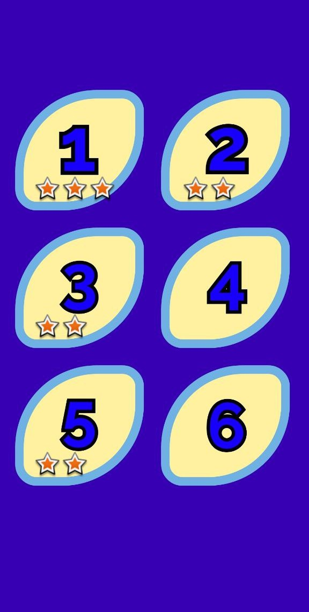
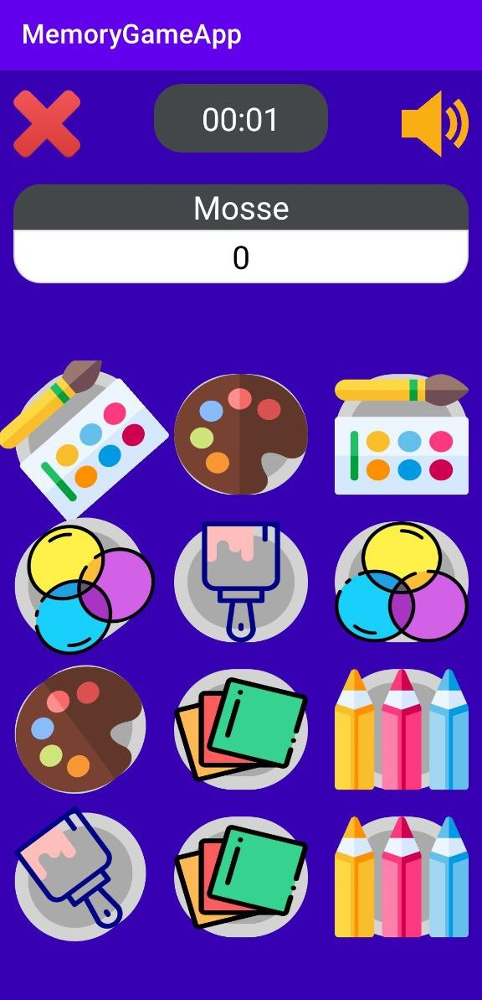
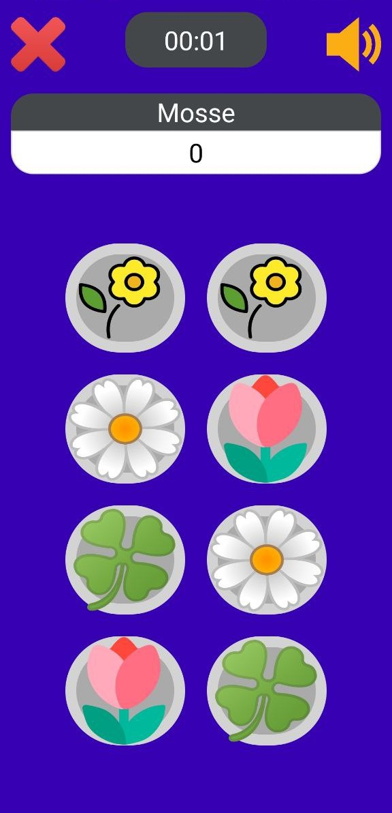

### Memory Game 
A mobile game designed to challenge and enhance your memory skills. Developed using Java programming language and Android Studio, this app offers a user-friendly interface and captivating gameplay.

Features:

- Intuitive User Interface: The app boasts a sleek and intuitive user interface that ensures a seamless and enjoyable gaming experience.
- Grid-based Gameplay: Memory Master features a grid-based layout where players are presented with an array of face-down cards. The goal is to match pairs of identical cards by flipping them over two at a time.

- Multiple Difficulty Levels: Players can choose from various difficulty levels, ranging from easy to expert. Each level increases the grid size, adding complexity to the game and challenging the player's memory capacity.

- Score Tracking: Memory Master keeps track of players' scores and elapsed time, encouraging friendly competition among users to achieve the fastest completion times and the highest scores.

